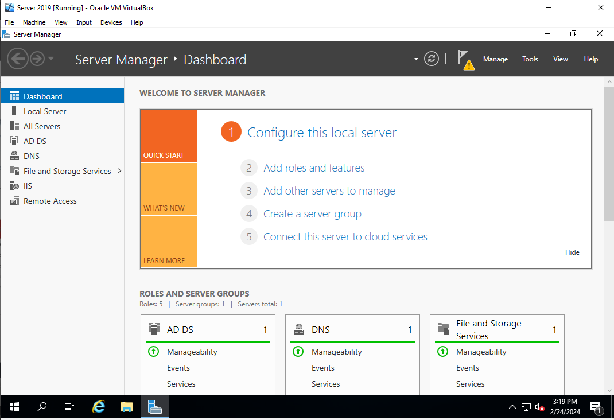
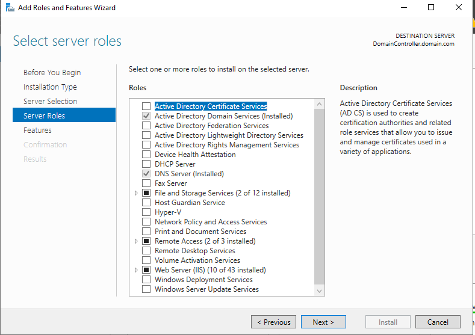
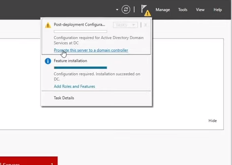
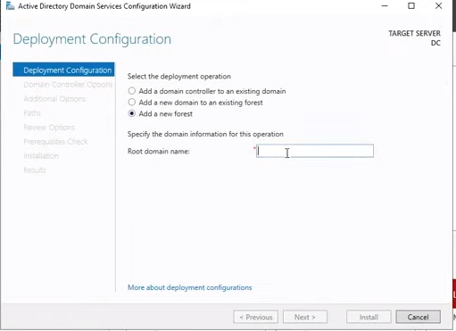
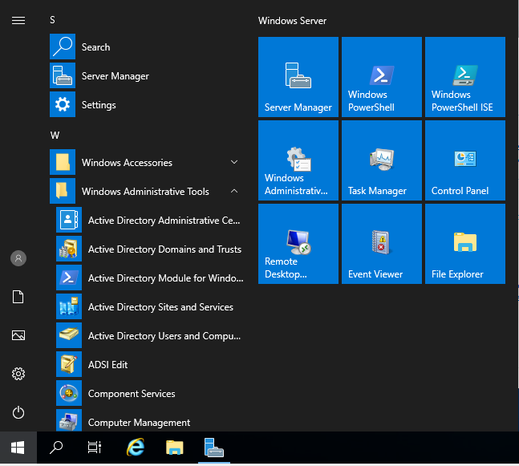
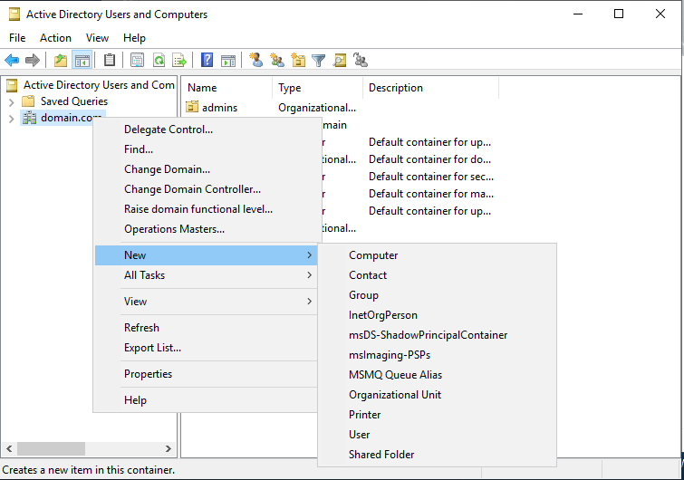
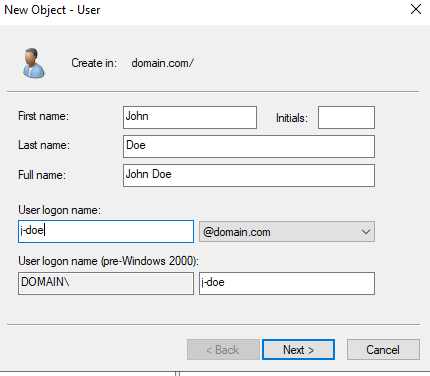
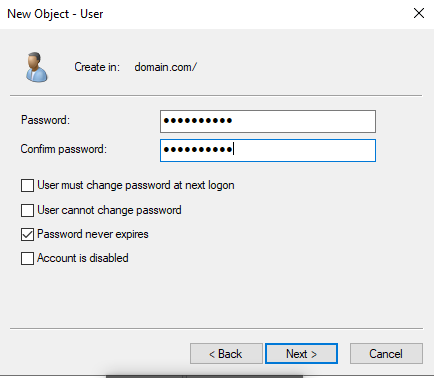

# Installing Active Directory and Creating a User
After implementing Windows Server 2019, we would be prompted with the Server Manager. Click 'Add roles and features'

Check 'Active Directory Domain Services' under the 'Roles' section and click next until you can install. 

Click the Flag w/caution sign then 'Promote this server to domain controller'

In the 'Deployment Configuration' click 'Add a new forest' and enter the domain (ex: domain.com)

Click the Start/Windows option, navigate to 'Active Directory Users and Computer'

The AD Users and Computers prompts up, Right Click your domain, Click 'New', 'User'

We can now create our new user accordingly

Perferably, check the 'User must change password at next logon', click next.

